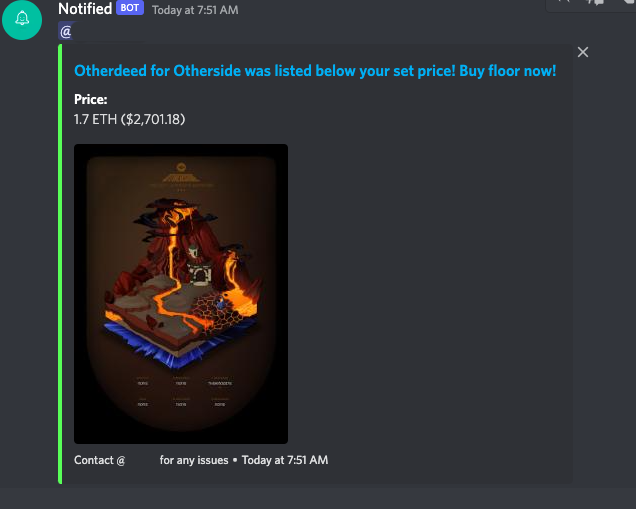

# Create and Receive Price Alerts via Discord



# Requirements
[Create A Discord Bot Here](https://discord.com/developers/docs/intro)

[Create a Mongo DB here](https://www.mongodb.com/)

[Get an Opensea API key here](https://docs.opensea.io/reference/request-an-api-key)

[Get an Etherscan API key here](https://etherscan.io/apis)

[Get Started with Redis here](https://redis.io/)

Create a .env file with your keys
```
DISCORD_TOKEN=XXXXXXX
MONGOOSE_URI=XXXXXXX
ETHERSCAN_API_KEY=XXXXXXX
OPENSEA_API_KEY=XXXXXXX
```

## Setup

Make sure to install the dependencies:

```bash
yarn install
```

## Development Server

```bash
yarn start
```
